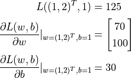

# Tensorflow 2 基础

TensorFlow 2 中，即时执行模式（Eager Execution）为默认模式；若要关闭即时执行模式，则需调用 `tf.compat.v1.disable_eager_execution()` 函数。


## 基础数据结构

TensorFlow 使用 **张量** （Tensor）作为数据的基本单位。TensorFlow 的张量在概念上等同于多维数组，我们可以使用它来描述数学中的标量（0 维数组）、向量（1 维数组）、矩阵（2 维数组）等各种量: 

```python
# 定义一个随机数（标量）
random_float = tf.random.uniform(shape=())

# 定义一个有2个元素的零向量
zero_vector = tf.zeros(shape=(2))

# 定义两个2×2的常量矩阵
A = tf.constant([[1., 2.], [3., 4.]])
B = tf.constant([[5., 6.], [7., 8.]])
```

张量的重要属性是其形状、类型和值。可以通过张量的 `shape` 、 `dtype` 属性和 `numpy()` 方法获得:

```python
# 查看矩阵A的形状、类型和值
print(A.shape)      # 输出(2, 2)，即矩阵的长和宽均为2
print(A.dtype)      # 输出<dtype: 'float32'>
print(A.numpy())    # 输出[[1. 2.]
                    #      [3. 4.]]
```

TensorFlow 的大多数 API 函数会根据输入的值自动推断张量中元素的类型（一般默认为 `tf.float32` ），也可以通过加入 `dtype` 参数来自行指定类型。张量的 `numpy()` 方法是将张量的值转换为一个 `NumPy` 数组。

TensorFlow 里有大量的 `操作` （Operation），使得我们可以将已有的张量进行运算后得到新的张量:

```python
C = tf.add(A, B)    # 计算矩阵A和B的和
D = tf.matmul(A, B) # 计算矩阵A和B的乘积

'''
C = tf.Tensor(
[[ 6.  8.]
 [10. 12.]], shape=(2, 2), dtype=float32)

D = tf.Tensor(
[[19. 22.]
 [43. 50.]], shape=(2, 2), dtype=float32)
 '''
```

此外还有：
`tf.square()` 操作代表对输入张量的每一个元素求平方，不改变张量形状。 `tf.reduce_sum()` 操作代表对输入张量的所有元素求和，输出一个形状为空的纯量张量（可以通过 `axis` 参数来指定求和的维度，不指定则默认对所有元素求和）。

TensorFlow 中有大量的张量操作 API，包括数学运算、张量形状操作（如 `tf.reshape()`）、切片和连接（如 `tf.concat()`）等多种类型，可以通过查阅 TensorFlow 的[官方 API 文档](https://www.tensorflow.org/api_docs/python/tf) 来进一步了解。

## 自动求导机制

TensorFlow 提供了强大的 自动求导机制 来计算导数。在即时执行模式下，TensorFlow 引入了 `tf.GradientTape()` 这个 “求导记录器” 来实现自动求导。

计算函数 y(x) = x^2 在 x = 3 时的导数：

```python
import tensorflow as tf

x = tf.Variable(initial_value=3.)
with tf.GradientTape() as tape:     # 在 tf.GradientTape() 的上下文内，所有计算步骤都会被记录以用于求导
    y = tf.square(x)                # 对输入张量的每一个元素求平方，不改变张量形状
y_grad = tape.gradient(y, x)        # 计算y关于x的导数
print(y, y_grad)
```

**变量** （Variable），使用 `tf.Variable()` 声明。与普通张量一样，变量同样具有形状、类型和值三种属性。使用变量需要有一个初始化过程，可以通过在 tf.Variable() 中指定 `initial_value` 参数来指定初始值。  
变量与普通张量的一个重要区别是其默认能够被 TensorFlow 的自动求导机制所求导，因此往往被用于定义机器学习模型的参数。  
这里将变量 x 初始化为 3. 。

`tf.GradientTape()` 是一个自动求导的记录器。只要进入了 `with tf.GradientTape() as tape` 的上下文环境，则在该环境中计算步骤都会被自动记录。比如在上面的示例中，计算步骤 `y = tf.square(x)` 即被自动记录。

离开上下文环境后，记录将停止，但记录器 `tape` 依然可用，因此可以通过 `y_grad = tape.gradient(y, x)` 求张量 y 对变量 x 的导数。

在机器学习中，更加常见的是对多元函数求偏导数，以及对向量或矩阵的求导。

计算函数 $L(w, b) = \|Xw + b - y\|^2$ 在 $w = (1, 2)^T, b = 1$ 时分别对 w, b 的偏导数。其中:  
$$ X = \begin{bmatrix} 1 & 2 \\ 3 & 4 \end{bmatrix},  y = \begin{bmatrix} 1 \\ 2\end{bmatrix}$$

```python
X = tf.constant([[1., 2.], [3., 4.]])
y = tf.constant([[1.], [2.]])
w = tf.Variable(initial_value=[[1.], [2.]])
b = tf.Variable(initial_value=1.)
with tf.GradientTape() as tape:
    L = tf.reduce_sum(tf.square(tf.matmul(X, w) + b - y))  # 对输入张量的所有元素求和，输出一个形状为空的纯量张量
w_grad, b_grad = tape.gradient(L, [w, b])        # 计算L(w, b)关于w, b的偏导数
print(L, w_grad, b_grad)
```

从输出可见，TensorFlow 帮助我们计算出了：




## 线性回归模型

[线性回归示例](./LinearRegression.md)

