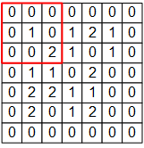
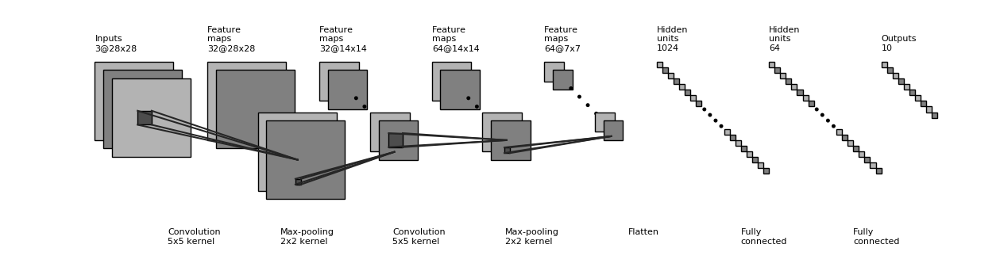

# 卷积神经网络

卷积神经网络 （Convolutional Neural Network, CNN）是一种结构类似于人类或动物的 视觉系统 的人工神经网络，包含一个或多个卷积层（Convolutional Layer）、池化层（Pooling Layer）和全连接层（Fully-connected Layer）。


## 卷积层和池化层的工作原理

**卷积层**（Convolutional Layer，以 `tf.keras.layers.Conv2D` 为代表）是 CNN 的核心组件，其结构与大脑的视觉皮层有类似之处。

对于全连接层，每个神经元与上一层的所有神经元相连。不过，在视觉皮层的神经元中，情况并不是这样。**感受野** （Receptive Field），即视觉皮层中的神经元并非与前一层的所有神经元相连，而只是感受一片区域内的视觉信号，并只对局部区域的视觉刺激进行反应。CNN 中的卷积层正体现了这一特性。

例如，一个 7×7 的单通道图片信号输入：


如果使用之前基于全连接层的模型，我们需要让每个输入信号对应一个权值，即建模一个神经元需要 7×7=49 个权值（加上偏置项是 50 个），并得到一个输出信号。如果一层有 N 个神经元，我们就需要 49N 个权值，并得到 N 个输出信号。

而在 CNN 的卷积层中，我们这样建模一个卷积层的神经元：



其中 3×3 的红框代表该神经元的感受野。由此，建模一个神经元只需要 3×3=9 个权值：  

 ，

外加 1 个偏置项 b ，即可得到一个输出信号。对于红框的位置，输出信号即为将矩阵：  

，  

的所有元素求和并加上偏置项 $b$，记作 $a_{1, 1}$ 。

不过，3×3 的范围显然不足以处理整个图像，因此我们使用滑动窗口的方法。使用相同的参数 W ，但将红框在图像中从左到右滑动，进行逐行扫描，每滑动到一个位置就计算一个值。  
例如，当红框向右移动一个单位时，我们计算矩阵

，

的所有元素的和并加上偏置项 $b$，记作 $a_{1, 2}$ 。

由此，和一般的神经元只能输出 1 个值不同，这里的卷积层神经元可以输出一个 5×5 的矩阵： 

。

一个单通道的 7×7 图像在通过一个感受野为 3×3 ，参数为 10 个的卷积层神经元后，得到 5×5 的矩阵作为卷积结果：


可以使用 TensorFlow 来验证一下上图的计算结果。

1. 将上图中的输入图像、权值矩阵 $W$ 和偏置项 $b$ 表示为 NumPy 数组 `image` , `W` , `b` 如下：

```python
# TensorFlow 的图像表示为 [图像数目，长，宽，色彩通道数] 的四维张量
# 这里我们的输入图像 image 的张量形状为 [1, 7, 7, 1]
image = np.array([[
    [0, 0, 0, 0, 0, 0, 0],
    [0, 1, 0, 1, 2, 1, 0],
    [0, 0, 2, 2, 0, 1, 0],
    [0, 1, 1, 0, 2, 1, 0],
    [0, 0, 2, 1, 1, 0, 0],
    [0, 2, 1, 1, 2, 0, 0],
    [0, 0, 0, 0, 0, 0, 0]
]], dtype=np.float32)
image = np.expand_dims(image, axis=-1)  
W = np.array([[
    [ 0, 0, -1], 
    [ 0, 1, 0 ], 
    [-2, 0, 2 ]
]], dtype=np.float32)
b = np.array([1], dtype=np.float32)
```

2. 然后建立一个仅有一个卷积层的模型，用 `W` 和 `b` 初始化：

```python
model = tf.keras.models.Sequential([
    tf.keras.layers.Conv2D(
        filters=1,              # 卷积层神经元（卷积核）数目
        kernel_size=[3, 3],     # 感受野大小
        kernel_initializer=tf.constant_initializer(W),
        bias_initializer=tf.constant_initializer(b)
    )]
)
```

3. 最后将图像数据 `image` 输入模型，打印输出：

```python
output = model(image)
print(tf.squeeze(output))
```

以上假设图片都只有一个通道（例如灰度图片），但如果图像是彩色的（例如有 RGB 三个通道）该怎么办呢？此时，我们可以为每个通道准备一个 3×3 的权值矩阵，即一共有 3×3×3=27 个权值。对于每个通道，均使用自己的权值矩阵进行处理，输出时将多个通道所输出的值进行加和即可。

照上述介绍的方法，每次卷积后的结果相比于原始图像而言，四周都会 “少一圈”。比如上面 7×7 的图像，卷积后变成了 5×5 ，这有时会为后面的工作带来麻烦。因此，我们可以设定 `padding` 策略。在 `tf.keras.layers.Conv2D` 中，当我们将 `padding` 参数设为 `same` 时，会将周围缺少的部分使用 0 补齐，使得输出的矩阵大小和输入一致。

同时，通过 `tf.keras.layers.Conv2D` 的 `strides` 参数即可设置滑动步长（默认为 1）。比如，在上面的例子中，如果我们将步长设定为 2，输出的卷积结果即会是一个 3×3 的矩阵。

更多卷积方式的示例可见 [Convolution arithmetic](https://github.com/vdumoulin/conv_arithmetic) 。

**池化层**（Pooling Layer）的理解则简单得多，其可以理解为对图像进行降采样的过程，对于每一次滑动窗口中的所有原始值，输出其中的最大值（MaxPooling）、均值或其他方法产生的值。  
例如，对于一个三通道的 16×16 图像（即一个 `16*16*3` 的张量），经过感受野为 2×2，滑动步长为 2 的池化层，则得到一个 `8*8*3` 的张量。


## 使用 Keras 实现卷积神经网络

卷积神经网络和 [多层感知机](./MultilayerPerceptron.md) 在代码结构上很类似，只是新加入了一些卷积层和池化层。这里的网络结构并不是唯一的，可以增加、删除或调整 CNN 的网络结构（比如加入 Dropout 层防止过拟合）和参数，以达到更好的性能。

```python
class CNN(tf.keras.Model):
    def __init__(self):
        super().__init__()
        self.conv1 = tf.keras.layers.Conv2D(
            filters=32,             # 卷积层神经元（卷积核）数目
            kernel_size=[5, 5],     # 感受野大小
            padding='same',         # padding策略（vaild 或 same）
            activation=tf.nn.relu   # 激活函数
        )
        self.pool1 = tf.keras.layers.MaxPool2D(pool_size=[2, 2], strides=2)
        self.conv2 = tf.keras.layers.Conv2D(
            filters=64,
            kernel_size=[5, 5],
            padding='same',
            activation=tf.nn.relu
        )
        self.pool2 = tf.keras.layers.MaxPool2D(pool_size=[2, 2], strides=2)
        self.flatten = tf.keras.layers.Reshape(target_shape=(7 * 7 * 64,))
        self.dense1 = tf.keras.layers.Dense(units=1024, activation=tf.nn.relu)
        self.dense2 = tf.keras.layers.Dense(units=10)

    def call(self, inputs):
        x = self.conv1(inputs)                  # [batch_size, 28, 28, 32]
        x = self.pool1(x)                       # [batch_size, 14, 14, 32]
        x = self.conv2(x)                       # [batch_size, 14, 14, 64]
        x = self.pool2(x)                       # [batch_size, 7, 7, 64]
        x = self.flatten(x)                     # [batch_size, 7 * 7 * 64]
        x = self.dense1(x)                      # [batch_size, 1024]
        x = self.dense2(x)                      # [batch_size, 10]
        output = tf.nn.softmax(x)
        return output
```




## 使用 Keras 中预定义的经典卷积神经网络结构

`tf.keras.applications` 中有一些预定义好的经典卷积神经网络结构，如 `VGG16` 、 `VGG19` 、 `ResNet` 、 `MobileNet` 等。我们可以直接调用这些经典的卷积神经网络结构（甚至载入预训练的参数），而无需手动定义网络结构。

例如，可以实例化一个 `MobileNetV2` 网络结构：

```python
model = tf.keras.applications.MobileNetV2()
```
当执行以上代码时，TensorFlow 会自动从网络上下载 `MobileNetV2` 网络的预训练权值，因此在第一次执行代码时需要具备网络连接。也可以通过将参数 `weights` 设置为 `None` 来随机初始化变量而不使用预训练权值。  
每个网络结构具有自己特定的详细参数设置，一些共通的常用参数如下：

+ `input_shape` ：输入张量的形状（不含第一维的 Batch），大多默认为 `224 × 224 × 3` 。一般而言，模型对输入张量的大小有下限，长和宽至少为 `32 × 32` 或 `75 × 75` ；
+ `include_top` ：在网络的最后是否包含全连接层，默认为 `True` ；
+ `weights` ：预训练权值，默认为 `'imagenet'` ，即为当前模型载入在 ImageNet 数据集上预训练的权值。如需随机初始化变量可设为 `None` ；
+ `classes` ：分类数，默认为 1000。修改该参数需要 `include_top` 参数为 `True` 且 `weights` 参数为 `None` 。

各网络模型参数的详细介绍可参考 [Keras 文档](https://keras.io/api/applications/) 。

以下展示一个例子，使用 `MobileNetV2` 网络在 `tf_flowers` 五分类数据集上进行训练（为了代码的简短高效，在该示例中我们使用了 TensorFlow Datasets 和 tf.data 载入和预处理数据）。同时将 `classes` 设置为 5，对应于 5 分类的数据集。

```python
import tensorflow as tf
import tensorflow_datasets as tfds

num_epoch = 5
batch_size = 50
learning_rate = 0.001

dataset = tfds.load("tf_flowers", split=tfds.Split.TRAIN, as_supervised=True)
dataset = dataset.map(lambda img, label: (tf.image.resize(img, (224, 224)) / 255.0, label)).shuffle(1024).batch(batch_size)
model = tf.keras.applications.MobileNetV2(weights=None, classes=5)
optimizer = tf.keras.optimizers.Adam(learning_rate=learning_rate)
for e in range(num_epoch):
    for images, labels in dataset:
        with tf.GradientTape() as tape:
            labels_pred = model(images, training=True)
            loss = tf.keras.losses.sparse_categorical_crossentropy(y_true=labels, y_pred=labels_pred)
            loss = tf.reduce_mean(loss)
            print("loss %f" % loss.numpy())
        grads = tape.gradient(loss, model.trainable_variables)
        optimizer.apply_gradients(grads_and_vars=zip(grads, model.trainable_variables))
    print(labels_pred)
```