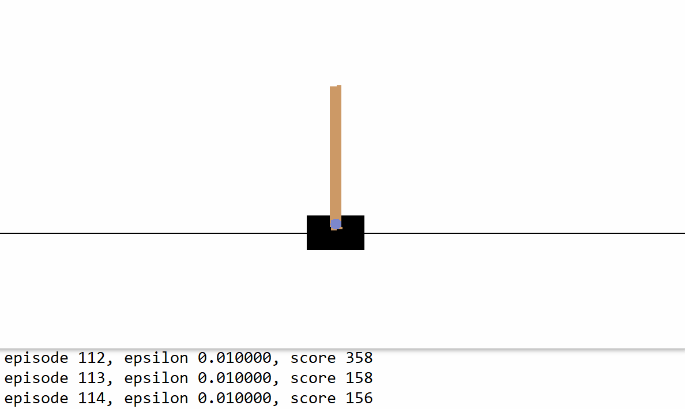

# 深度强化学习

[强化学习](https://tf.wiki/zh_hans/appendix/rl.html)（Reinforcement learning，RL）强调如何基于环境而行动，以取得最大化的预期利益。强化学习多用在需要与环境交互的场景下，即给定一个环境的状态（State），程序根据某种策略（Policy）选出一个对应的行为（Action），而执行这个Action后环境又会发生改变，即状态会转换为新的状态S'，且每执行完一个Action后程序会得到一个激励值（Reward），而程序就依据得到的激励值的大小调整其策略，使得在所有步骤执行完后，即状态到达终止状态（Terminal）时，所获得的Reward之和最大。

**深度学习**（Deep Learning） 是采用深度神经网络（Deep Learning Network, DNN）的机器学习。神经网络是基于感知机的扩展，而 DNN 可以理解为有很多隐藏层的神经网络。DNN有时也叫做多层感知机（Multi-Layer perceptron, MLP）。　　
从DNN按不同层的位置划分，DNN内部的神经网络层可以分为三类，输入层，隐藏层和输出层。一般来说第一层是输入层，最后一层是输出层，而中间的层数都是隐藏层。

结合了深度学习（Deep Learning）技术后的强化学习（Deep Reinforcement learning，DRL）更是如虎添翼。


## 深度强化学习玩 CartPole 游戏

倒立摆（CartPole）是控制论中的经典问题，在这个游戏中，一根杆的底部与一个小车通过轴相连，而杆的重心在轴之上，因此是一个不稳定的系统。在重力的作用下，杆很容易倒下。而我们则需要控制小车在水平的轨道上进行左右运动，以使得杆一直保持竖直平衡状态。



我们使用 OpenAI 推出的 Gym 环境库 中的 CartPole 游戏环境，可使用 `pip install gym` 进行安装。和 Gym 的交互过程很像是一个回合制游戏，我们首先获得游戏的初始状态（比如杆的初始角度和小车位置），然后在每个回合 t，我们都需要在当前可行的动作中选择一个并交由 Gym 执行（比如向左或者向右推动小车，每个回合中二者只能择一），Gym 在执行动作后，会返回动作执行后的下一个状态和当前回合所获得的奖励值（比如我们选择向左推动小车并执行后，小车位置更加偏左，而杆的角度更加偏右，Gym 将新的角度和位置返回给我们。而如果杆在这一回合仍没有倒下，Gym 同时返回给我们一个小的正奖励）。这个过程可以一直迭代下去，直到游戏终止（比如杆倒下了）。

在 Python 中，Gym 的基本调用方法如下：

```python
import gym

env = gym.make('CartPole-v1')       # 实例化一个游戏环境，参数为游戏名称
state = env.reset()                 # 初始化环境，获得初始状态
while True:
    env.render()                    # 对当前帧进行渲染，绘图到屏幕
    action = model.predict(state)   # 假设我们有一个训练好的模型，能够通过当前状态预测出这时应该进行的动作
    next_state, reward, done, info = env.step(action)   # 让环境执行动作，获得执行完动作的下一个状态，动作的奖励，游戏是否已结束以及额外信息
    if done:                        # 如果游戏结束则退出循环
        break
```

那么，我们的任务就是训练出一个模型，能够根据当前的状态预测出应该进行的一个好的动作。粗略地说，一个好的动作应当能够最大化整个游戏过程中获得的奖励之和，这也是强化学习的目标。  
以 CartPole 游戏为例，我们的目标是希望做出合适的动作使得杆一直不倒，即游戏交互的回合数尽可能地多。而回合每进行一次，我们都会获得一个小的正奖励，回合数越多则累积的奖励值也越高。因此，我们最大化游戏过程中的奖励之和与我们的最终目标是一致的。

为了使用深度强化学习中的 Deep Q-Learning 方法来训练模型。首先，我们引入 TensorFlow、Gym 和一些常用库，并定义一些模型超参数：

```python
import tensorflow as tf
import numpy as np
import gym
import random
from collections import deque

num_episodes = 500              # 游戏训练的总episode数量
num_exploration_episodes = 100  # 探索过程所占的episode数量
max_len_episode = 1000          # 每个episode的最大回合数
batch_size = 32                 # 批次大小
learning_rate = 1e-3            # 学习率
gamma = 1.                      # 折扣因子
initial_epsilon = 1.            # 探索起始时的探索率
final_epsilon = 0.01            # 探索终止时的探索率
```

然后，我们使用 `tf.keras.Model` 建立一个 Q 函数网络（Q-network），用于拟合 Q Learning 中的 Q 函数。  

**Q-learning 算法** 是强化学习中的一种，更准确的说，是一种关于策略的选择方式。实际上，我们可以发现，强化学习的核心和训练目标就是选择一个合适的策略 Policy，使得在每个 epoch 结束时得到的 reward 之和最大。
Q-learning 的思想：$Q(S, A)$ = 在状态 $S$ 下，采取动作 $A$ 后，未来将得到的奖励 Reward 总和。
Q值大体上有两种更新方式，一种是状态和行为的组合是可以穷尽的情况，这时候往往采用的是 `S-A表格` 的形式记录 Q值；而如果状态和行为的组合不可穷尽，这时候常用的方式为将深度学习与Q学习结合起来（Deep Q Network，深度Q网络）。

这里使用较简单的多层全连接神经网络进行拟合。该网络输入当前状态，输出各个动作下的 Q-value（CartPole 下为 2 维，即向左和向右推动小车）。

```python
class QNetwork(tf.keras.Model):
    def __init__(self):
        super().__init__()
        self.dense1 = tf.keras.layers.Dense(units=24, activation=tf.nn.relu)
        self.dense2 = tf.keras.layers.Dense(units=24, activation=tf.nn.relu)
        self.dense3 = tf.keras.layers.Dense(units=2)

    def call(self, inputs):
        x = self.dense1(inputs)
        x = self.dense2(x)
        x = self.dense3(x)
        return x

    def predict(self, inputs):
        q_values = self(inputs)
        return tf.argmax(q_values, axis=-1)
```

最后，我们在主程序中实现 Q Learning 算法。

```python
if __name__ == '__main__':
    env = gym.make('CartPole-v1')       # 实例化一个游戏环境，参数为游戏名称
    model = QNetwork()
    optimizer = tf.keras.optimizers.Adam(learning_rate=learning_rate)
    replay_buffer = deque(maxlen=10000) # 使用一个 deque 作为 Q Learning 的经验回放池
    epsilon = initial_epsilon
    for episode_id in range(num_episodes):
        state = env.reset()             # 初始化环境，获得初始状态
        epsilon = max(                  # 计算当前探索率
            initial_epsilon * (num_exploration_episodes - episode_id) / num_exploration_episodes,
            final_epsilon)
        for t in range(max_len_episode):
            env.render()                                # 对当前帧进行渲染，绘图到屏幕
            if random.random() < epsilon:               # epsilon-greedy 探索策略，以 epsilon 的概率选择随机动作
                action = env.action_space.sample()      # 选择随机动作（探索）
            else:
                action = model.predict(np.expand_dims(state, axis=0)).numpy()   # 选择模型计算出的 Q Value 最大的动作
                action = action[0]

            # 让环境执行动作，获得执行完动作的下一个状态，动作的奖励，游戏是否已结束以及额外信息
            next_state, reward, done, info = env.step(action)
            # 如果游戏Game Over，给予大的负奖励
            reward = -10. if done else reward
            # 将(state, action, reward, next_state)的四元组（外加 done 标签表示是否结束）放入经验回放池
            replay_buffer.append((state, action, reward, next_state, 1 if done else 0))
            # 更新当前 state
            state = next_state

            if done:                                    # 游戏结束则退出本轮循环，进行下一个 episode
                print("episode %4d, epsilon %.4f, score %4d" % (episode_id, epsilon, t))
                break

            if len(replay_buffer) >= batch_size:
                # 从经验回放池中随机取一个批次的四元组，并分别转换为 NumPy 数组
                batch_state, batch_action, batch_reward, batch_next_state, batch_done = \
                    map(np.array, zip(*random.sample(replay_buffer, batch_size)))

                q_value = model(batch_next_state)
                y = batch_reward + (gamma * tf.reduce_max(q_value, axis=1)) * (1 - batch_done)  # 计算 y 值
                with tf.GradientTape() as tape:
                    loss = tf.keras.losses.mean_squared_error(  # 最小化 y 和 Q-value 的距离
                        y_true=y,
                        y_pred=tf.reduce_sum(model(batch_state) * tf.one_hot(batch_action, depth=2), axis=1)
                    )
                grads = tape.gradient(loss, model.variables)
                optimizer.apply_gradients(grads_and_vars=zip(grads, model.variables))       # 计算梯度并更新参数
```

对于不同的任务（或者说环境），我们需要根据任务的特点，设计不同的状态以及采取合适的网络来拟合 Q 函数。

例如，如果我们考虑经典的打砖块游戏（Gym 环境库中的 `Breakout-v0` ），每一次执行动作（挡板向左、向右或不动），都会返回一个 `210 * 160 * 3` 的 RGB 图片，表示当前屏幕画面。为了给打砖块游戏这个任务设计合适的状态表示，我们有以下分析：

+ 砖块的颜色信息并不是很重要，画面转换成灰度也不影响操作，因此可以去除状态中的颜色信息（即将图片转为灰度表示）；
+ 小球移动的信息很重要，如果只知道单帧画面而不知道小球往哪边运动，即使是人也很难判断挡板应当移动的方向。因此，必须在状态中加入表征小球运动方向的信息。一个简单的方式是将当前帧与前面几帧的画面进行叠加，得到一个 `210 * 160 * X` （X 为叠加帧数）的状态表示；
+ 每帧的分辨率不需要特别高，只要能大致表征方块、小球和挡板的位置以做出决策即可，因此对于每帧的长宽可做适当压缩。

而考虑到我们需要从图像信息中提取特征，使用 CNN 作为拟合 Q 函数的网络将更为适合。由此，将上面的 `QNetwork` 更换为 CNN 网络，并对状态做一些修改，即可用于玩一些简单的视频游戏。
