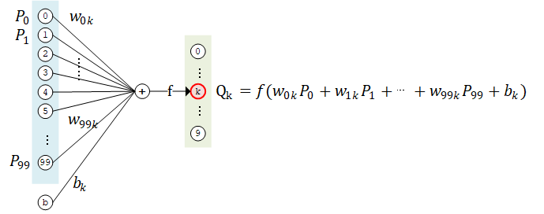

# 多层感知机

从编写一个最简单的 **多层感知机** （Multilayer Perceptron, MLP），或者说 “多层全连接神经网络” 开始，介绍 TensorFlow 的模型编写方式。在这一部分，我们依次进行以下步骤：

+ 使用 `tf.keras.datasets` 获得数据集并预处理;
+ 使用 `tf.keras.Model` 和 `tf.keras.layers` 构建模型;
+ 构建模型训练流程，使用 `tf.keras.losses` 计算损失函数，使用 `tf.keras.optimizer` 优化模型;
+ 构建模型评估流程，使用 `tf.keras.metrics` 计算评估指标.

使用多层感知机完成 MNIST 手写体数字图片数据集的分类任务。


## 数据获取及预处理： `tf.keras.datasets`

使用 `tf.keras.datasets` 实现一个简单的 `MNISTLoader` 类来读取 MNIST 数据集数据，快速载入 MNIST 数据集。

```python
class MNISTLoader():
    def __init__(self):
        mnist = tf.keras.datasets.mnist
        (self.train_data, self.train_label), (self.test_data, self.test_label) = mnist.load_data()
        # MNIST中的图像默认为uint8（0-255的数字）。以下代码将其归一化到0-1之间的浮点数，并在最后增加一维作为颜色通道
        self.train_data = np.expand_dims(self.train_data.astype(np.float32) / 255.0, axis=-1)      # [60000, 28, 28, 1]
        self.test_data = np.expand_dims(self.test_data.astype(np.float32) / 255.0, axis=-1)        # [10000, 28, 28, 1]
        self.train_label = self.train_label.astype(np.int32)    # [60000]
        self.test_label = self.test_label.astype(np.int32)      # [10000]
        self.num_train_data, self.num_test_data = self.train_data.shape[0], self.test_data.shape[0]

    def get_batch(self, batch_size):
        # 从数据集中随机取出batch_size个元素并返回
        index = np.random.randint(0, self.num_train_data, batch_size)
        return self.train_data[index, :], self.train_label[index]
```

在 TensorFlow 中，图像数据集的一种典型表示是 `[图像数目，长，宽，色彩通道数]` 的四维张量。在上面的 `DataLoader` 类中， `self.train_data` 和 `self.test_data` 分别载入了 60,000 和 10,000 张大小为 `28*28` 的手写体数字图片。由于这里读入的是灰度图片，色彩通道数为 1（彩色 RGB 图像色彩通道数为 3），所以我们使用 `np.expand_dims()` 函数为图像数据手动在最后添加一维通道。


## 模型的构建： `tf.keras.Model` 和 `tf.keras.layers`

多层感知机的模型类实现与线性模型类似，使用 `tf.keras.Model` 和 `tf.keras.layers` 构建，所不同的地方在于层数增加了，以及引入了非线性激活函数（这里使用了 **ReLU 函数** ， 即下方的 `activation=tf.nn.relu` ）。  
该模型输入一个向量（比如这里是拉直的 `1×784` 手写体数字图片），输出 10 维的向量，分别代表这张图片属于 0 到 9 的概率。

```python
class MLP(tf.keras.Model):
    def __init__(self):
        super().__init__()
        self.flatten = tf.keras.layers.Flatten()    # Flatten层将除第一维（batch_size）以外的维度展平
        self.dense1 = tf.keras.layers.Dense(units=100, activation=tf.nn.relu)
        self.dense2 = tf.keras.layers.Dense(units=10)

    def call(self, inputs):         # [batch_size, 28, 28, 1]
        x = self.flatten(inputs)    # [batch_size, 784]
        x = self.dense1(x)          # [batch_size, 100]
        x = self.dense2(x)          # [batch_size, 10]
        output = tf.nn.softmax(x)
        return output
```

这里，因为我们希望输出 “输入图片分别属于 0 到 9 的概率”，也就是一个 10 维的离散概率分布，所以我们希望这个 10 维向量至少满足两个条件：

+ 该向量中的每个元素均在 [0, 1] 之间；
+ 该向量的所有元素之和为 1。

为使模型的输出能始终满足这两个条件，使用 **Softmax** 函数 （归一化指数函数， `tf.nn.softmax`）对模型的原始输出进行归一化。其形式为 $\sigma(\mathbf{z})_j = \frac{e^{z_j}}{\sum_{k=1}^K e^{z_k}}$ 。不仅如此，softmax 函数能够凸显原始向量中最大的值，并抑制远低于最大值的其他分量，这也是该函数被称作 softmax 函数的原因（即平滑化的 argmax 函数）。


## 模型的训练： `tf.keras.losses` 和 `tf.keras.optimizer`

定义一些模型超参数：

```python
num_epochs = 5
batch_size = 50
learning_rate = 0.001
```

实例化模型和数据读取类，并实例化一个 `tf.keras.optimizer` 的优化器。  
（这里使用常用的 Adam 优化器）：

```python
model = MLP()
data_loader = MNISTLoader()
optimizer = tf.keras.optimizers.Adam(learning_rate=learning_rate)
```

然后迭代进行以下步骤：

+ 从 `DataLoader` 中随机取一批训练数据；
+ 将这批数据送入模型，计算出模型的预测值；
+ 将模型预测值与真实值进行比较，计算损失函数（loss）。这里使用 `tf.keras.losses` 中的交叉熵函数作为损失函数；
+ 计算损失函数关于模型变量的导数；
+ 将求出的导数值传入优化器，使用优化器的 `apply_gradients` 方法更新模型参数以最小化损失函数。

```python
num_batches = int(data_loader.num_train_data // batch_size *num_epochs)
for batch_index in range(num_batches):
    X, y = data_loader.get_batch(batch_size)
    with tf.GradientTape() as tape:
        y_pred = model(X)
        loss = tf.keras.losses.sparse_categorical_crossentropy(y_true=y, y_pred=y_pred)
        loss = tf.reduce_mean(loss)
        print("batch %d: loss %f" % (batch_index, loss.numpy()))
    grads = tape.gradient(loss, model.variables)
    optimizer.apply_gradients(grads_and_vars=zip(grads, model.variables))
```

**交叉熵** 作为损失函数，在分类问题中被广泛应用。其离散形式为 $H(y, \hat{y}) = -\sum_{i=1}^{n}y_i \log(\hat{y_i})$ ，其中 y 为真实概率分布， $\hat{y} $为预测概率分布， n 为分类任务的类别个数。预测概率分布与真实分布越接近，则交叉熵的值越小，反之则越大。

在 `tf.keras` 中，有两个交叉熵相关的损失函数 `tf.keras.losses.categorical_crossentropy` 和 `tf.keras.losses.sparse_categorical_crossentropy` 。其中 `sparse` 的含义是，真实的标签值 y_true 可以直接传入 int 类型的标签类别。


## 模型的评估： `tf.keras.metrics`

使用 `tf.keras.metrics` 中的 `SparseCategoricalAccuracy` 评估器来评估模型在测试集上的性能，该评估器能够对模型预测的结果与真实结果进行比较，并输出预测正确的样本数占总样本数的比例。  
我们迭代测试数据集，每次通过 `update_state()` 方法向评估器输入两个参数： `y_pred` 和 `y_true` ，即模型预测出的结果和真实结果。  
评估器具有内部变量来保存当前评估指标相关的参数数值（例如当前已传入的累计样本数和当前预测正确的样本数）。迭代结束后，我们使用 `result()` 方法输出最终的评估指标值（预测正确的样本数占总样本数的比例）。

通过实例化一个 `tf.keras.metrics.SparseCategoricalAccuracy` 评估器，并使用 `For` 循环迭代分批次传入了测试集数据的预测结果与真实结果，并输出训练后的模型在测试数据集上的准确率。

```python
parse_categorical_accuracy = tf.keras.metrics.SparseCategoricalAccuracy()
num_batches = int(data_loader.num_test_data // batch_size)
for batch_index in range(num_batches):
    start_index, end_index = batch_index * batch_size, (batch_index + 1) * batch_size
    y_pred = model.predict(data_loader.test_data[start_index: end_index])
    sparse_categorical_accuracy.update_state(y_true=data_loader.test_label[start_index: end_index], y_pred=y_pred)
print("test accuracy: %f" % sparse_categorical_accuracy.result())
```

如果将上面的神经网络放大来看，详细研究计算过程，比如取第二层的第 k 个计算单元，可以得到示意图如下：



该计算单元 $Q_k$ 有 100 个权值参数 $w_{0k}, w_{1k}, ..., w_{99k}$ 和 1 个偏置参数 $b_k$ 。将第 1 层中所有的 100 个计算单元 $P_0, P_1, ..., P_{99}$ 的值作为输入，分别按权值 $w_{ik}$ 加和（即 $\sum_{i=0}^{99} w_{ik} P_i$ ），并加上偏置值 $b_k$ ，然后送入激活函数 $f$ 进行计算，即得到输出结果。

在上面的例子里，第二层的每一个计算单元（人工神经元）有 100 个权值参数和 1 个偏置参数，而第二层计算单元的数目是 10 个，因此这一个全连接层的总参数量为 100*10 个权值参数和 10 个偏置参数。事实上，这正是该全连接层中的两个变量 `kernel` 和 `bias` 的形状。