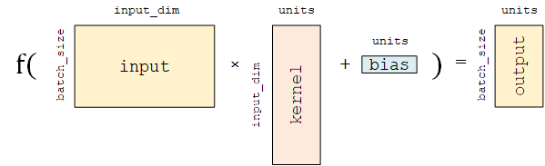

# 模型建立和训练

在 TensorFlow 中，推荐使用 Keras（ `tf.keras` ）构建模型。Keras 是一个广为流行的高级神经网络 API，简单、快速而不失灵活性，现已得到 TensorFlow 的官方内置和全面支持。

## 模型（Model）和层（Layer）

Keras 有两个重要的概念： **模型（Model）** 和 **层（Layer）** 。

层将各种计算流程和变量进行了封装（例如基本的全连接层，CNN 的卷积层、池化层等），而模型则将各种层进行组织和连接，并封装成一个整体，描述了如何将输入数据通过各种层以及运算而得到输出。在需要模型调用的时候，使用 `y_pred = model(X)` 的形式即可。Keras 在 `tf.keras.layers` 下内置了深度学习中大量常用的的预定义层，同时也允许我们自定义层。

Keras 模型以类的形式呈现，我们可以通过继承 `tf.keras.Model` 这个 Python 类来定义自己的模型。在继承类中，我们需要重写 `__init__()` （构造函数，初始化）和 `call(input)` （模型调用）两个方法，同时也可以根据需要增加自定义的方法。

```python
class MyModel(tf.keras.Model):
    def __init__(self):
        super().__init__()     
        # 此处添加初始化代码（包含 call 方法中会用到的层），例如
        # layer1 = tf.keras.layers.BuiltInLayer(...)
        # layer2 = MyCustomLayer(...)

    def call(self, input):
        # 此处添加模型调用的代码（处理输入并返回输出），例如
        # x = layer1(input)
        # output = layer2(x)
        return output

    # 还可以添加自定义的方法
```


继承 `tf.keras.Model` 后，我们同时可以使用父类的若干方法和属性，例如在实例化类 `model = Model()` 后，可以通过 `model.variables` 这一属性直接获得模型中的所有变量。

简单的线性模型 $y_{pred} = a * X + b $，我们可以通过模型类的方式编写如下：

```python
import tensorflow as tf

X = tf.constant([[1.0, 2.0, 3.0], [4.0, 5.0, 6.0]])
y = tf.constant([[10.0], [20.0]])


class Linear(tf.keras.Model):
    def __init__(self):
        super().__init__()
        self.dense = tf.keras.layers.Dense(
            units=1,  # 输出张量的维度（每个参数有几份）
            activation=None,  # 激活函数
            kernel_initializer=tf.zeros_initializer(), # 参数初始化方式
            bias_initializer=tf.zeros_initializer() # 偏置初始化方式
        )

    def call(self, input):
        output = self.dense(input)
        return output

model = Linear()
optimizer = tf.keras.optimizers.SGD(learning_rate=0.01)
for i in range(100):
    with tf.GradientTape() as tape:
        y_pred = model(X)      # 调用模型 y_pred = model(X) 而不是显式写出 y_pred = a * X + b
        loss = tf.reduce_mean(tf.square(y_pred - y))
    grads = tape.gradient(loss, model.variables)    # 使用 model.variables 这一属性直接获得模型中的所有变量
    optimizer.apply_gradients(grads_and_vars=zip(grads, model.variables))
print(model.variables)
```

这里，我们没有显式地声明 a 和 b 两个变量并写出 $y_{pred} = a * X + b$ 这一线性变换，而是建立了一个继承了 `tf.keras.Model` 的模型类 `Linear` 。这个类在初始化部分实例化了一个 全连接层 （ `tf.keras.layers.Dense` ），并在 `call` 方法中对这个层进行调用，实现了线性变换的计算。

**全连接层** （Fully-connected Layer，`tf.keras.layers.Dense` ）是 Keras 中最基础和常用的层之一，对输入矩阵 $A$ 进行 $f(AW + b)$ 的线性变换 + 激活函数操作。如果不指定激活函数，即是纯粹的线性变换 $AW + b$。  
具体而言，给定输入张量 `input = [batch_size, input_dim]` ，该层对输入张量首先进行 `tf.matmul(input, kernel) + bias` 的线性变换（ `kernel` 和 `bias` 是层中可训练的变量），然后对线性变换后张量的每个元素通过激活函数 `activation` ，从而输出形状为 `[batch_size, units]` 的二维张量。



其包含的主要参数如下：

+ `units` ：输出张量的维度；
+ `activation` ：激活函数，对应于 $f(AW + b)$ 中的 $f$ ，默认为无激活函数（ `a(x) = x` ）。常用的激活函数包括 `tf.nn.relu` 、 `tf.nn.tanh` 和 `tf.nn.sigmoid` ；
+ `use_bias` ：是否加入偏置向量 `bias` ，即 $f(AW + b)$ 中的 $b$。默认为 `True` ；
+ `kernel_initializer` 、 `bias_initializer` ：权重矩阵 `kernel` 和偏置向量 `bias` 两个变量的初始化器。默认为 `tf.glorot_uniform_initializer` 。设置为 `tf.zeros_initializer` 表示将两个变量均初始化为全 0；

该层包含权重矩阵 `kernel = [input_dim, units]` 和偏置向量 `bias = [units]`  两个可训练变量，对应于 $f(AW + b)$ 中的 $W$ 和 $b$。


## 多层感知机

[多层感知机示例](./MultilayerPerceptron.md)