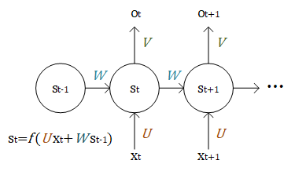
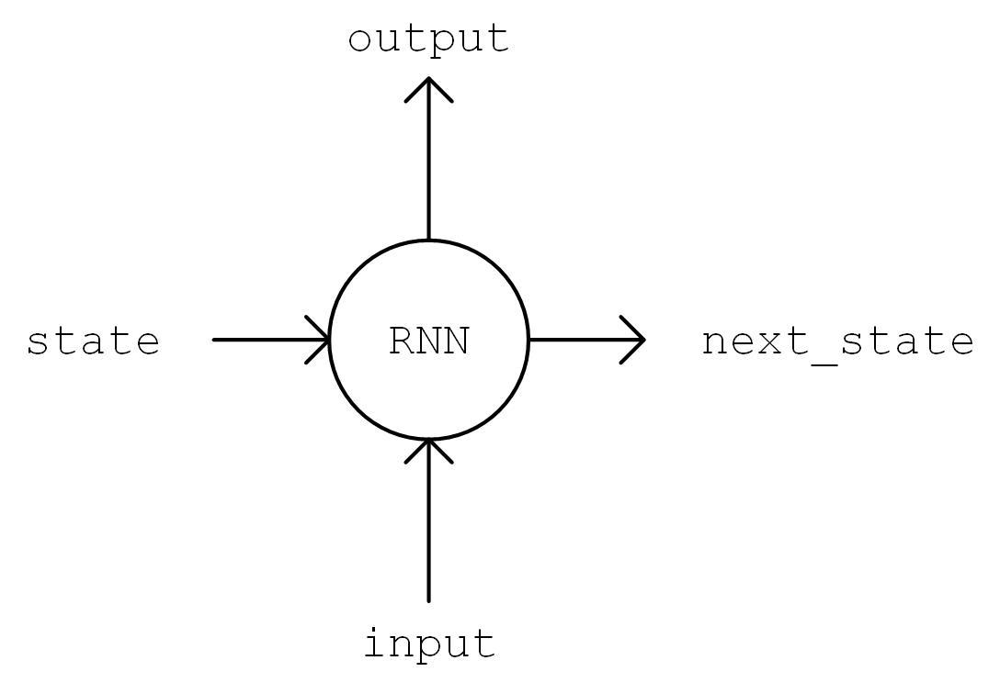
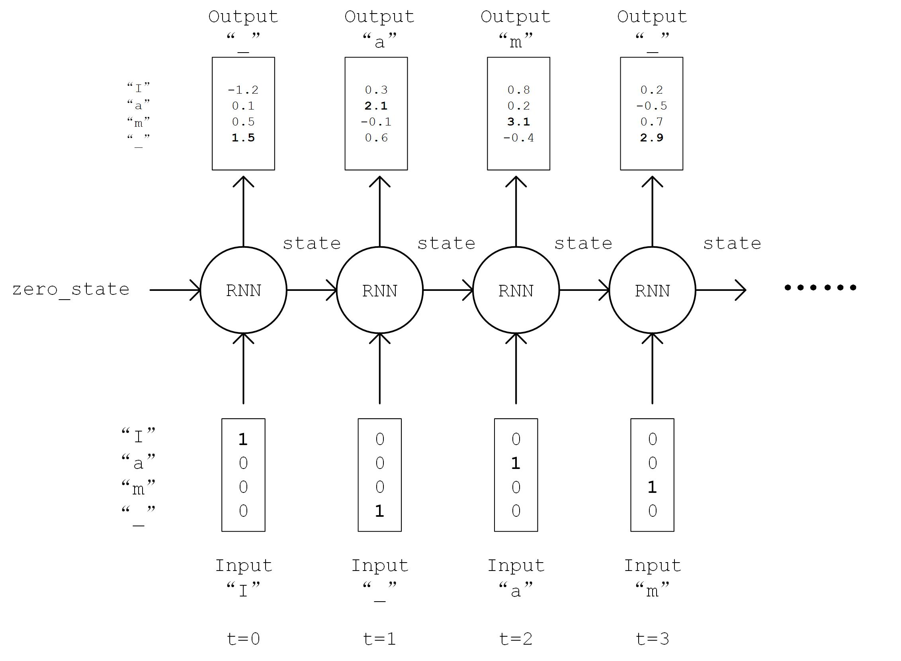

# 循环神经网络

循环神经网络（Recurrent Neural Network, RNN）是一种适宜于处理序列数据的神经网络，被广泛用于语言模型、文本生成、机器翻译等。


## 循环神经网络的工作过程

循环神经网络是一个处理时间序列数据的神经网络结构，也就是说，我们需要在脑海里有一根时间轴，循环神经网络具有初始状态 $s_0$ ，在每个时间点 $t$ 迭代对当前时间的输入 $x_t$ 进行处理，修改自身的状态 $s_t$ ，并进行输出 $o_t$ 。

循环神经网络的核心是状态 $s$ ，是一个特定维数的向量，类似于神经网络的 “记忆”。在 $t=0$ 的初始时刻，$s_0$ 被赋予一个初始值（常用的为全 0 向量）。然后，采用类似于递归的方法来描述循环神经网络的工作过程。即在 $t$ 时刻，我们假设 $s_{t-1}$ 已经求出，关注如何在此基础上求出 $s_{t}$ ：

+ 对输入向量 $x_t$ 通过矩阵 $U$ 进行线性变换，$U x_t$ 与状态 $s$ 具有相同的维度；
+ 对 $s_{t-1}$ 通过矩阵 $W$ 进行线性变换，$W s_{t-1}$ 与状态 $s$ 具有相同的维度；
+ 将上述得到的两个向量相加并通过激活函数，作为当前状态 $s_t$ 的值，即 $s_t = f(U x_t + W s_{t-1})$。也就是说，**当前状态的值是上一个状态的值和当前输入进行某种信息整合而产生的**；
+ 对当前状态 $s_t$ 通过矩阵 $V$ 进行线性变换，得到当前时刻的输出 $o_t$。



我们假设输入向量 $x_t$ 、状态 $s$ 和输出向量 $o_t$ 的维度分别为 $m、n、p$，则 $U \in \mathbb{R}^{m \times n}、W \in \mathbb{R}^{n \times n}、V \in \mathbb{R}^{n \times p}$。

在实际使用时往往使用一些常见的改进型，如 LSTM（长短期记忆神经网络，解决了长序列的梯度消失问题，适用于较长的序列）、GRU 等。


## 使用 RNN 来进行尼采风格文本的自动生成

这个任务的本质其实预测一段英文文本的接续字母的概率分布。比如，有以下句子:

    I am a studen

这个句子（序列）一共有 13 个字符（包含空格）。当我们阅读到这个由 13 个字符组成的序列后，根据我们的经验，我们可以预测出下一个字符很大概率是 “t”。我们希望建立这样一个模型，逐个输入一段长为 `seq_length` 的序列，输出这些序列接续的下一个字符的概率分布。我们从下一个字符的概率分布中采样作为预测值，然后滚雪球式地生成下两个字符，下三个字符等等，即可完成文本的生成任务。

首先，还是实现一个简单的 `DataLoader` 类来读取文本，并以字符为单位进行编码。设字符种类数为 `num_chars` ，则每种字符赋予一个 0 到 `num_chars - 1` 之间的唯一整数编号 i。

```python
class DataLoader():
    def __init__(self):
        path = tf.keras.utils.get_file('nietzsche.txt',
            origin='https://s3.amazonaws.com/text-datasets/nietzsche.txt')
        with open(path, encoding='utf-8') as f:
            self.raw_text = f.read().lower()
        self.chars = sorted(list(set(self.raw_text)))
        self.char_indices = dict((c, i) for i, c in enumerate(self.chars))
        self.indices_char = dict((i, c) for i, c in enumerate(self.chars))
        self.text = [self.char_indices[c] for c in self.raw_text]

    def get_batch(self, seq_length, batch_size):
        seq = []
        next_char = []
        for i in range(batch_size):
            index = np.random.randint(0, len(self.text) - seq_length)
            seq.append(self.text[index:index+seq_length])
            next_char.append(self.text[index+seq_length])
        return np.array(seq), np.array(next_char)       # [batch_size, seq_length], [num_batch]
```

接下来进行模型的实现。在 `__init__` 方法中实例化一个常用的 `LSTMCell` 单元，以及一个线性变换用的全连接层，首先对序列进行 “One Hot” 操作，即将序列中的每个字符的编码 i 均变换为一个 `num_char` 维向量，其第 i 位为 1，其余均为 0。变换后的序列张量形状为 `[seq_length, num_chars]` 。然后，我们初始化 RNN 单元的状态，存入变量 `state` 中。接下来，将序列从头到尾依次送入 RNN 单元，即在 t 时刻，将上一个时刻 t-1 的 RNN 单元状态 `state` 和序列的第 t 个元素 `inputs[t, :]` 送入 RNN 单元，得到当前时刻的输出 `output` 和 RNN 单元状态。取 RNN 单元最后一次的输出，通过全连接层变换到 `num_chars` 维，即作为模型的输出。




```python
class RNN(tf.keras.Model):
    def __init__(self, num_chars, batch_size, seq_length):
        super().__init__()
        self.num_chars = num_chars
        self.seq_length = seq_length
        self.batch_size = batch_size
        self.cell = tf.keras.layers.LSTMCell(units=256)
        self.dense = tf.keras.layers.Dense(units=self.num_chars)

    def call(self, inputs, from_logits=False):
        inputs = tf.one_hot(inputs, depth=self.num_chars)       # [batch_size, seq_length, num_chars]
        state = self.cell.get_initial_state(batch_size=self.batch_size, dtype=tf.float32)   # 获得 RNN 的初始状态
        for t in range(self.seq_length):
            output, state = self.cell(inputs[:, t, :], state)   # 通过当前输入和前一时刻的状态，得到输出和当前时刻的状态
        logits = self.dense(output)
        if from_logits:                     # from_logits 参数控制输出是否通过 softmax 函数进行归一化
            return logits
        else:
            return tf.nn.softmax(logits)
```

定义一些模型超参数：

    num_batches = 1000
    seq_length = 40
    batch_size = 50
    learning_rate = 1e-3

训练过程：

+ 从 `DataLoader` 中随机取一批训练数据；
+ 将这批数据送入模型，计算出模型的预测值；
+ 将模型预测值与真实值进行比较，计算损失函数（loss）；
+ 计算损失函数关于模型变量的导数；
+ 使用优化器更新模型参数以最小化损失函数。

```python
data_loader = DataLoader()
model = RNN(num_chars=len(data_loader.chars), batch_size=batch_size, seq_length=seq_length)
optimizer = tf.keras.optimizers.Adam(learning_rate=learning_rate)
for batch_index in range(num_batches):
    X, y = data_loader.get_batch(seq_length, batch_size)
    with tf.GradientTape() as tape:
        y_pred = model(X)
        loss = tf.keras.losses.sparse_categorical_crossentropy(y_true=y, y_pred=y_pred)
        loss = tf.reduce_mean(loss)
        print("batch %d: loss %f" % (batch_index, loss.numpy()))
    grads = tape.gradient(loss, model.variables)
    optimizer.apply_gradients(grads_and_vars=zip(grads, model.variables))
```

之前，我们一直使用 `tf.argmax()` 函数，将对应概率最大的值作为预测值。然而对于文本生成而言，这样的预测方式过于绝对，会使得生成的文本失去丰富性。于是，我们使用 `np.random.choice()` 函数按照生成的概率分布取样。这样，即使是对应概率较小的字符，也有机会被取样到。同时，我们加入一个 `temperature` 参数控制分布的形状，参数值越大则分布越平缓（最大值和最小值的差值越小），生成文本的丰富度越高；参数值越小则分布越陡峭，生成文本的丰富度越低。

为了实现这一点，为前面所建立的 RNN 类加入下面的 predict 成员函数：

```python
def predict(self, inputs, temperature=1.):
    batch_size, _ = tf.shape(inputs)
    logits = self(inputs, from_logits=True)                         # 调用训练好的RNN模型，预测下一个字符的概率分布
    prob = tf.nn.softmax(logits / temperature).numpy()              # 使用带 temperature 参数的 softmax 函数获得归一化的概率分布值
        return np.array([np.random.choice(self.num_chars, p=prob[i, :]) for i in range(batch_size.numpy())])    # 使用 np.random.choice 函数，在预测的概率分布 prob 上进行随机取样
```

通过这种方式进行 “滚雪球” 式的连续预测，即可得到生成文本。

```python
X_, _ = data_loader.get_batch(seq_length, 1)
for diversity in [0.2, 0.5, 1.0, 1.2]:      # 丰富度（即temperature）分别设置为从小到大的 4 个值
    X = X_
    print("diversity %f:" % diversity)
    for t in range(400):
        y_pred = model.predict(X, diversity)    # 预测下一个字符的编号
        print(data_loader.indices_char[y_pred[0]], end='', flush=True)  # 输出预测的字符
        X = np.concatenate([X[:, 1:], np.expand_dims(y_pred, axis=1)], axis=-1)     # 将预测的字符接在输入 X 的末尾，并截断 X 的第一个字符，以保证 X 的长度不变
    print("\n")
```