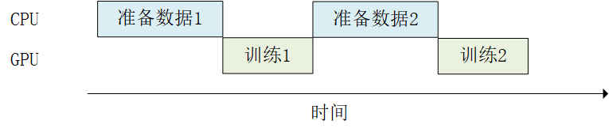
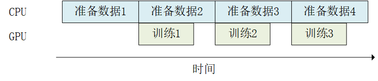
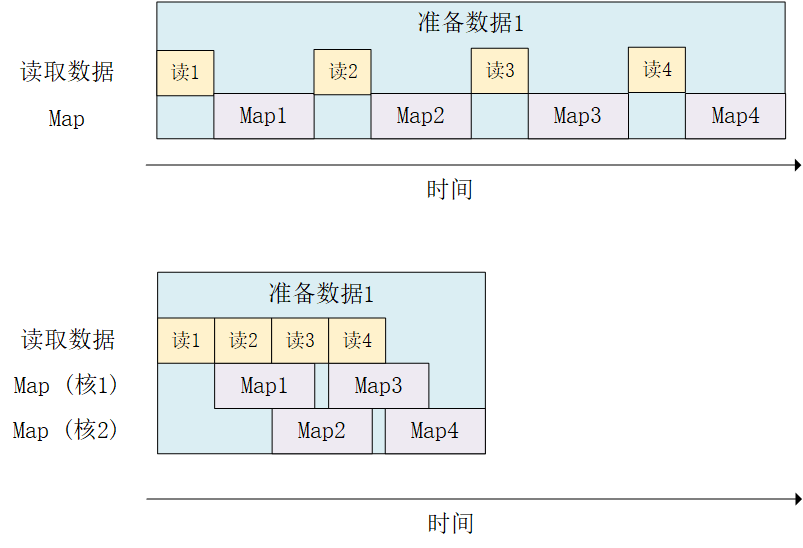

# TensorFlow 常用模块

+ [tf.train.Checkpoint：变量的保存与恢复](#`tf.train.Checkpoint`变量的保存与恢复)
+ [TensorBoard：训练过程可视化](#TensorBoard训练过程可视化)
    + [实时查看参数变化情况](#实时查看参数变化情况)
    + [查看Graph和Profile信息](#查看Graph和Profile信息)
+ [tf.data：数据集的构建与预处理](#tf.data数据集的构建与预处理)
    + [数据集对象的建立](#数据集对象的建立)
    + [数据集对象的预处理](#数据集对象的预处理)
    + [使用 tf.data 的并行化策略提高训练流程效率](#使用tf.data的并行化策略提高训练流程效率)
    + [利用多核心的优势对数据进行并行化变换](#利用多核心的优势对数据进行并行化变换)


## `tf.train.Checkpoint` ：变量的保存与恢复 

Checkpoint 只保存模型的参数，不保存模型的计算过程，因此一般用于在具有模型源代码的时候恢复之前训练好的模型参数。

很多时候，我们希望在模型训练完成后能将训练好的参数（变量）保存起来。在需要使用模型的其他地方载入模型和参数，就能直接得到训练好的模型。

TensorFlow 提供了 `tf.train.Checkpoint` 这一强大的变量保存与恢复类，可以使用其 `save()` 和 `restore()` 方法将 TensorFlow 中所有包含 Checkpointable State 的对象进行保存和恢复。  
具体而言，`tf.keras.optimizer` 、 `tf.Variable` 、 `tf.keras.Layer` 或者 `tf.keras.Model` 实例都可以被保存。其使用方法非常简单，我们首先声明一个 Checkpoint：

```python
checkpoint = tf.train.Checkpoint(model=model)
```

`tf.train.Checkpoint()` 接受的初始化参数比较特殊，是一个 `**kwargs `。具体而言，是一系列的键值对，键名可以随意取(在恢复变量的时候，我们还将使用这一键名)，值为需要保存的对象。例如，如果我们希望保存一个继承 `tf.keras.Model` 的模型实例 `model` 和一个继承 `tf.train.Optimizer` 的优化器 `optimizer` ，我们可以这样写：

```python
checkpoint = tf.train.Checkpoint(myAwesomeModel=model, myAwesomeOptimizer=optimizer)
```

接下来，当模型训练完成需要保存的时候，使用：

```python
checkpoint.save(save_path_with_prefix)
```

`save_path_with_prefix` 是保存文件的目录 + 前缀。例如，在源代码目录建立一个名为 save 的文件夹并调用一次 `checkpoint.save('./save/model.ckpt')` ，我们就可以在可以在 save 目录下发现名为 `checkpoint` 、 `model.ckpt-1.index` 、 `model.ckpt-1.data-00000-of-00001` 的三个文件，这些文件就记录了变量信息。`checkpoint.save()` 方法可以运行多次，每运行一次都会得到一个.index 文件和.data 文件，序号依次累加。

当在其他地方需要为模型重新载入之前保存的参数时，需要再次实例化一个 checkpoint，同时保持键名的一致。再调用 checkpoint 的 restore 方法。就像下面这样：

```python
model_to_be_restored = MyModel()    # 待恢复参数的同一模型
checkpoint = tf.train.Checkpoint(myAwesomeModel=model_to_be_restored)   # 键名保持为“myAwesomeModel”
checkpoint.restore(save_path_with_prefix_and_index)
```

即可恢复模型变量。 `save_path_with_prefix_and_index` 是之前保存的文件的目录 + 前缀 + 编号。例如，调用 `checkpoint.restore('./save/model.ckpt-1')` 就可以载入前缀为 model.ckpt ，序号为 1 的文件来恢复模型。

当保存了多个文件时，我们往往想载入最近的一个。可以使用 `tf.train.latest_checkpoint(save_path)` 这个辅助函数返回目录下最近一次 checkpoint 的文件名。例如如果 save 目录下有 model.ckpt-1.index 到 `model.ckpt-10.index` 的 10 个保存文件， `tf.train.latest_checkpoint('./save')` 即返回 `./save/model.ckpt-10` 。

总体而言，恢复与保存变量的典型代码框架如下：

```python
# train.py 模型训练阶段

model = MyModel()
# 实例化Checkpoint，指定保存对象为model（如果需要保存Optimizer的参数也可加入）
checkpoint = tf.train.Checkpoint(myModel=model)
# ...（模型训练代码）
# 模型训练完毕后将参数保存到文件（也可以在模型训练过程中每隔一段时间就保存一次）
checkpoint.save('./save/model.ckpt')

#------------------------------------------------------------------

# test.py 模型使用阶段

model = MyModel()
checkpoint = tf.train.Checkpoint(myModel=model)             # 实例化Checkpoint，指定恢复对象为model
checkpoint.restore(tf.train.latest_checkpoint('./save'))    # 从文件恢复模型参数
# ... 模型使用代码
```

[MLP模型参数保存示例](./CheckPointMlp.py)

在模型的训练过程中，我们往往每隔一定步数保存一个 Checkpoint 并进行编号。不过很多时候我们会有这样的需求：

+ 在长时间的训练后，程序会保存大量的 Checkpoint，但我们只想保留最后的几个 Checkpoint；
+ Checkpoint 默认从 1 开始编号，每次累加 1，但我们可能希望使用别的编号方式（例如使用当前 Batch 的编号作为文件编号）。

我们可以使用 TensorFlow 的 `tf.train.CheckpointManager` 来实现以上需求。具体而言，在定义 Checkpoint 后接着定义一个 CheckpointManager：

```python
checkpoint = tf.train.Checkpoint(model=model)
manager = tf.train.CheckpointManager(checkpoint, directory='./save', checkpoint_name='model.ckpt', max_to_keep=k)
```

此处， `directory` 参数为文件保存的路径， `checkpoint_name` 为文件名前缀（不提供则默认为 `ckpt` ）， `max_to_keep` 为保留的 Checkpoint 数目。


## TensorBoard：训练过程可视化 

TensorBoard 就是一个能够帮助我们将训练过程可视化的工具。

### 实时查看参数变化情况 

首先在代码目录下建立一个文件夹（如 `./tensorboard` ）存放 TensorBoard 的记录文件，并在代码中实例化一个记录器：

```python
summary_writer = tf.summary.create_file_writer('./tensorboard')     # 参数为记录文件所保存的目录
```

接下来，当需要记录训练过程中的参数时，通过 `with` 语句指定希望使用的记录器，并对需要记录的参数（一般是 scalar）运行 `tf.summary.scalar(name, tensor, step=batch_index)` ，即可将训练过程中参数在 `step` 时候的值记录下来。这里的 `step` 参数可根据自己的需要自行制定，一般可设置为当前训练过程中的 `batch` 序号。整体框架如下：

```python
summary_writer = tf.summary.create_file_writer('./tensorboard')
# 开始模型训练
for batch_index in range(num_batches):
    # ...（训练代码，当前batch的损失值放入变量loss中）
    with summary_writer.as_default():                               # 希望使用的记录器
        tf.summary.scalar("loss", loss, step=batch_index)
        tf.summary.scalar("MyScalar", my_scalar, step=batch_index)  # 还可以添加其他自定义的变量
```

每运行一次 `tf.summary.scalar()` ，记录器就会向记录文件中写入一条记录。除了最简单的标量（scalar）以外，TensorBoard 还可以对其他类型的数据（如图像，音频等）进行可视化，详见 TensorBoard 文档 。

当我们要对训练过程可视化时，在代码目录打开终端（如需要的话进入 TensorFlow 的 conda 环境），运行:

```python
tensorboard --logdir=./tensorboard
```

然后使用浏览器访问命令行程序所输出的网址（一般是 http://name-of-your-computer:6006），即可访问 TensorBoard 的可视界面。


默认情况下，TensorBoard 每 30 秒更新一次数据。不过也可以点击右上角的刷新按钮手动刷新。

TensorBoard 的使用有以下注意事项：

+ 如果需要重新训练，需要删除掉记录文件夹内的信息并重启 TensorBoard（或者建立一个新的记录文件夹并开启 TensorBoard， `--logdir` 参数设置为新建立的文件夹）；
+ 记录文件夹目录保持全英文。

### 查看 Graph 和 Profile 信息

我们可以在训练时使用 `tf.summary.trace_on` 开启 `Trace`，此时 TensorFlow 会将训练时的大量信息（如计算图的结构，每个操作所耗费的时间等）记录下来。在训练完成后，使用 `tf.summary.trace_export` 将记录结果输出到文件。

```python
tf.summary.trace_on(graph=True, profiler=True)  # 开启Trace，可以记录图结构和profile信息
# 进行训练
with summary_writer.as_default():
    tf.summary.trace_export(name="model_trace", step=0, profiler_outdir=log_dir)    # 保存Trace信息到文件
```

之后，我们就可以在 TensorBoard 中选择 “Profile”，以时间轴的方式查看各操作的耗时情况。如果使用了 `tf.function` 建立了计算图，也可以点击 “Graphs” 查看图结构。


## ` tf.data` ：数据集的构建与预处理

TensorFlow 提供了 `tf.data` 这一模块，包括了一套灵活的数据集构建 API，能够帮助我们快速、高效地构建数据输入的流水线，尤其适用于数据量巨大的场景。


### 数据集对象的建立

`tf.data` 的核心是 `tf.data.Dataset` 类，提供了对数据集的高层封装。`tf.data.Dataset` 由一系列的可迭代访问的元素（element）组成，每个元素包含一个或多个张量。比如说，对于一个由图像组成的数据集，每个元素可以是一个形状为 `长×宽×通道数` 的图片张量，也可以是由图片张量和图片标签张量组成的元组（Tuple）。

最基础的建立 `tf.data.Dataset` 的方法是使用 `tf.data.Dataset.from_tensor_slices()` ，适用于数据量较小（能够整个装进内存）的情况。具体而言，如果我们的数据集中的所有元素通过张量的第 0 维，拼接成一个大的张量（例如 MNIST 数据集的训练集即为一个 `[60000, 28, 28, 1]` 的张量，表示了 60000 张 `28*28` 的单通道灰度图像），那么我们提供一个这样的张量或者第 0 维大小相同的多个张量作为输入，即可按张量的第 0 维展开来构建数据集，数据集的元素数量为张量第 0 维的大小。具体示例如下：

```python
import tensorflow as tf
import numpy as np

X = tf.constant([2013, 2014, 2015, 2016, 2017])
Y = tf.constant([12000, 14000, 15000, 16500, 17500])

# 也可以使用NumPy数组，效果相同
# X = np.array([2013, 2014, 2015, 2016, 2017])
# Y = np.array([12000, 14000, 15000, 16500, 17500])

dataset = tf.data.Dataset.from_tensor_slices((X, Y))

for x, y in dataset:
    print(x.numpy(), y.numpy()) 
```

当提供多个张量作为输入时，张量的第 0 维大小必须相同，且必须将多个张量作为元组（Tuple，即使用 Python 中的小括号）拼接并作为输入。

类似地，我们可以载入前章的 MNIST 数据集：

```python
import matplotlib.pyplot as plt 

(train_data, train_label), (_, _) = tf.keras.datasets.mnist.load_data()
train_data = np.expand_dims(train_data.astype(np.float32) / 255.0, axis=-1)      # [60000, 28, 28, 1]
mnist_dataset = tf.data.Dataset.from_tensor_slices((train_data, train_label))

for image, label in mnist_dataset:
    plt.title(label.numpy())
    plt.imshow(image.numpy()[:, :, 0])
    plt.show()
```

对于特别巨大而无法完整载入内存的数据集，我们可以先将数据集处理为 TFRecord 格式，然后使用 `tf.data.TFRocordDataset()` 进行载入。

### 数据集对象的预处理

`tf.data.Dataset` 类为我们提供了多种数据集预处理方法。最常用的如：

+ `Dataset.map(f)` ：对数据集中的每个元素应用函数 `f` ，得到一个新的数据集（这部分往往结合 `tf.io` 进行读写和解码文件， `tf.image` 进行图像处理）；
+ `Dataset.shuffle(buffer_size)` ：将数据集打乱（设定一个固定大小的缓冲区（Buffer），取出前 `buffer_size` 个元素放入，并从缓冲区中随机采样，采样后的数据用后续数据替换）；
+ `Dataset.batch(batch_size)` ：将数据集分成批次，即对每 `batch_size` 个元素，使用 `tf.stack()` 在第 0 维合并，成为一个元素；

除此以外，还有 `Dataset.repeat()` （重复数据集的元素）、 `Dataset.reduce()` （与 Map 相对的聚合操作）、 `Dataset.take()` （截取数据集中的前若干个元素）等。

以 MNIST 数据集进行示例。使用 `Dataset.map()` 将所有图片旋转 90 度：

```python
def rot90(image, label):
    image = tf.image.rot90(image)
    return image, label

mnist_dataset = mnist_dataset.map(rot90)

for image, label in mnist_dataset:
    plt.title(label.numpy())
    plt.imshow(image.numpy()[:, :, 0])
    plt.show()
```

使用 `Dataset.batch()` 将数据集划分批次，每个批次的大小为 4：

```python
mnist_dataset = mnist_dataset.batch(4)

for images, labels in mnist_dataset:    # image: [4, 28, 28, 1], labels: [4]
    fig, axs = plt.subplots(1, 4)
    for i in range(4):
        axs[i].set_title(labels.numpy()[i])
        axs[i].imshow(images.numpy()[i, :, :, 0])
    plt.show()
```

使用 `Dataset.shuffle()` 将数据打散后再设置批次，缓存大小设置为 10000：

```python
mnist_dataset = mnist_dataset.shuffle(buffer_size=10000).batch(4)

for images, labels in mnist_dataset:
    fig, axs = plt.subplots(1, 4)
    for i in range(4):
        axs[i].set_title(labels.numpy()[i])
        axs[i].imshow(images.numpy()[i, :, :, 0])
    plt.show()
```

`tf.data.Dataset` 作为一个针对大规模数据设计的 **迭代器**，本身无法方便地获得自身元素的数量或随机访问元素。因此，为了高效且较为充分地打散数据集，需要一些特定的方法。`Dataset.shuffle()` 采取了以下方法：

+ 设定一个固定大小为 `buffer_size` 的缓冲区（Buffer）；
+ 初始化时，取出数据集中的前 `buffer_size` 个元素放入缓冲区；
+ 每次需要从数据集中取元素时，即从缓冲区中随机采样一个元素并取出，然后从后续的元素中取出一个放回到之前被取出的位置，以维持缓冲区的大小。

因此，缓冲区的大小需要根据数据集的特性和数据排列顺序特点来进行合理的设置。比如：

+ 当` buffer_size` 设置为 1 时，其实等价于没有进行任何打散；
+ 当数据集的标签顺序分布极为不均匀（例如二元分类时数据集前 N 个的标签为 0，后 N 个的标签为 1）时，较小的缓冲区大小会使得训练时取出的 Batch 数据很可能全为同一标签，从而影响训练效果。

一般而言，数据集的顺序分布若较为随机，则缓冲区的大小可较小，否则则需要设置较大的缓冲区。

### 使用 tf.data 的并行化策略提高训练流程效率

当训练模型时，我们希望充分利用计算资源，减少 CPU/GPU 的空载时间。然而有时，数据集的准备处理非常耗时，使得我们在每进行一次训练前都需要花费大量的时间准备待训练的数据，而此时 GPU 只能空载而等待数据，造成了计算资源的浪费，如下图所示：



此时， `tf.data` 的数据集对象为我们提供了 `Dataset.prefetch()` 方法，使得我们可以让数据集对象 `Dataset` 在训练时预取出若干个元素，使得在 GPU 训练的同时 CPU 可以准备数据，从而提升训练流程的效率，如下图所示：



`Dataset.prefetch()` 的使用方法和前节的 `Dataset.batch()` 、 `Dataset.shuffle()` 等非常类似。继续以 MNIST 数据集为例，若希望开启预加载数据，使用如下代码即可：

```python
mnist_dataset = mnist_dataset.prefetch(buffer_size=tf.data.experimental.AUTOTUNE)
```

此处参数 `buffer_size` 既可手工设置，也可设置为 `tf.data.experimental.AUTOTUNE` 从而由 TensorFlow 自动选择合适的数值。

与此类似， `Dataset.map()` 也可以利用多 GPU 资源，并行化地对数据项进行变换，从而提高效率。以 MNIST 数据集为例，假设用于训练的计算机具有 2 核的 CPU，我们希望充分利用多核心的优势对数据进行并行化变换（比如旋转 90 度函数 rot90 ），可以使用以下代码：

```python
mnist_dataset = mnist_dataset.map(map_func=rot90, num_parallel_calls=2)
```

其运行过程如下图所示：



当然，这里同样可以将 `num_parallel_calls` 设置为 `tf.data.experimental.AUTOTUNE` 以让 TensorFlow 自动选择合适的数值。

除此以外，还有很多提升数据集处理性能的方式，可参考 [TensorFlow 文档](https://www.tensorflow.org/guide/data_performance) 进一步了解。


### 数据集元素的获取与使用

构建好数据并预处理后，我们需要从其中迭代获取数据以用于训练。`tf.data.Dataset` 是一个 Python 的可迭代对象，因此可以使用 For 循环迭代获取数据，即：

```python
dataset = tf.data.Dataset.from_tensor_slices((A, B, C, ...))
for a, b, c, ... in dataset:
    # 对张量a, b, c等进行操作，例如送入模型进行训练
```

也可以使用 `iter()` 显式创建一个 Python 迭代器并使用 `next()` 获取下一个元素，即：

```python
dataset = tf.data.Dataset.from_tensor_slices((A, B, C, ...))
it = iter(dataset)
a_0, b_0, c_0, ... = next(it)
a_1, b_1, c_1, ... = next(it)
```

Keras 支持使用 `tf.data.Dataset` 直接作为输入。当调用 `tf.keras.Model` 的 `fit()` 和 `evaluate()` 方法时，可以将参数中的输入数据 x 指定为一个元素格式为 (输入数据, 标签数据) 的 Dataset ，并忽略掉参数中的标签数据 y 。例如，对于 MNIST 数据集，常规的 Keras 训练方式是:

```python
model.fit(x=train_data, y=train_label, epochs=num_epochs, batch_size=batch_size)
```

使用 `tf.data.Dataset` 后，我们可以直接传入 Dataset ：

```python
model.fit(mnist_dataset, epochs=num_epochs)
```

由于已经通过 `Dataset.batch()` 方法划分了数据集的批次，所以这里也无需提供批次的大小。


